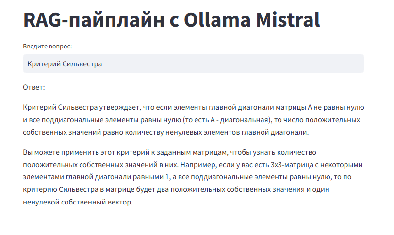
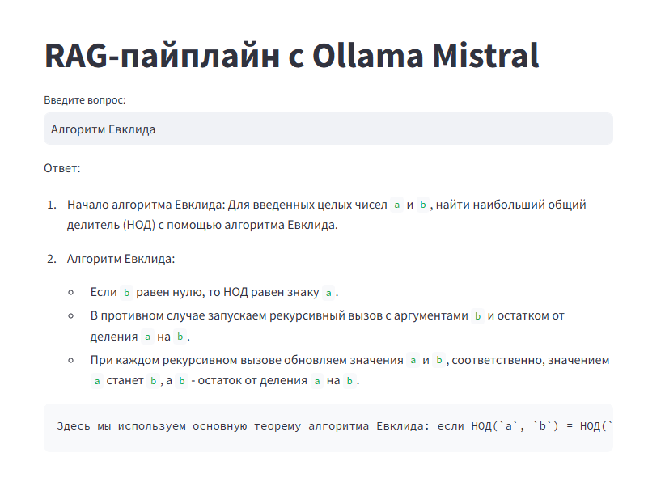

# RAG-pipeline_ollama-mistral
## Описание
Пример реализации RAG для обработки вопросов на основе учебных материалов. Взаимодействие реализовано с помощью веб-интерфейса streamlit.

## Установка
1. Клонируйте репозиторий:

git clone https://github.com/C918A/RAG-pipeline_ollama-mistral.git cd RAG-pipeline_ollama-mistral

2. Установите зависимости:

pip install -r requirements.txt

3. Запустите приложение (/src):

streamlit run app.py

## Демонстрация работы
1. Запросы связанный с контекстом

2. Запрос не связанный с контекстом

